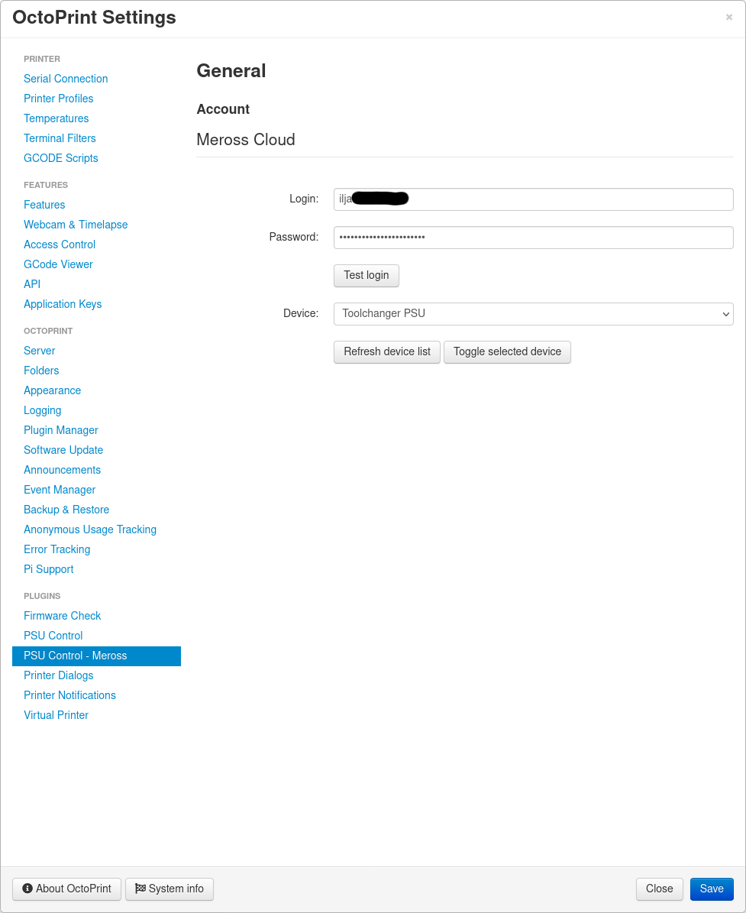
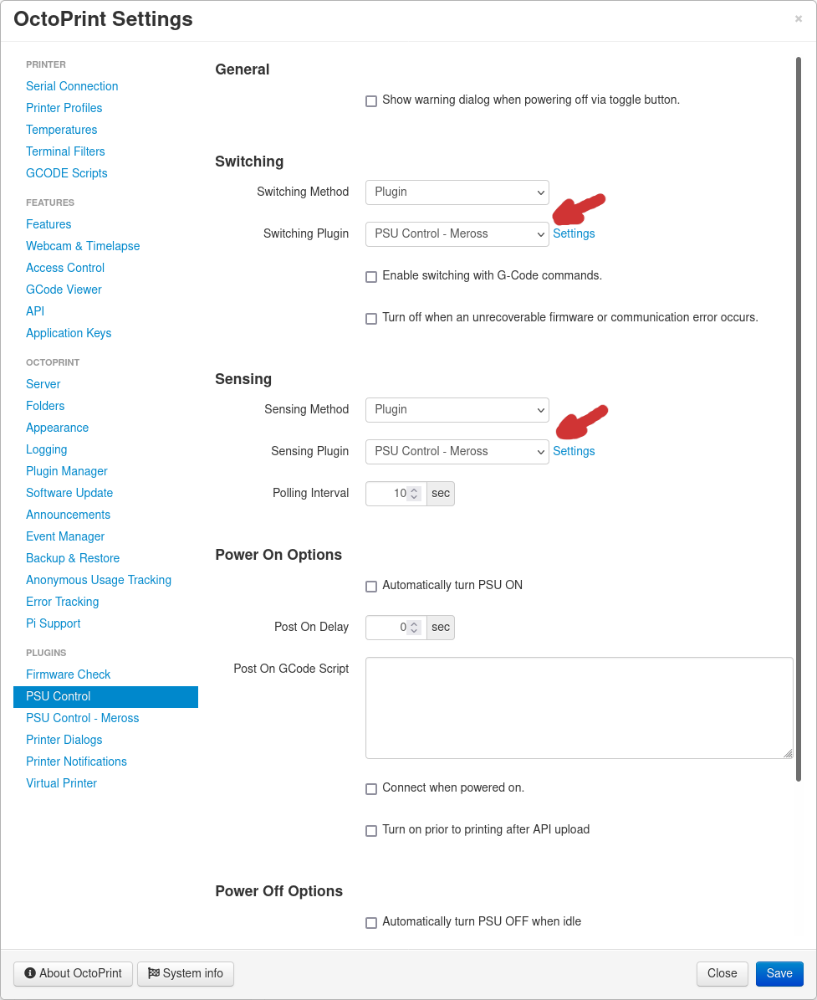

# OctoPrint-PSUControl-Meross

This plugin enables the "PSU Control" plugin to control Meross devices.

## Configuring PSU Control

Please note that you need to configure the "PSU Control" plugin
for it to use this sub-plugin to toggle the device.

